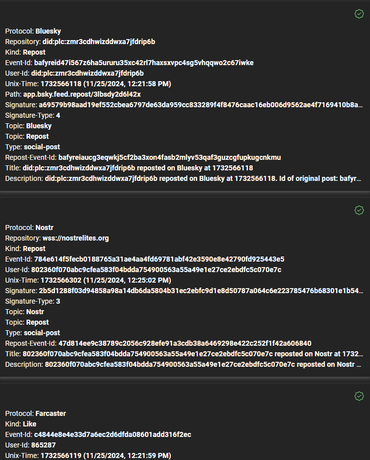

# Hoover Data Browser

## Overview

The **Hoover Data Browser** is a simple, single-page application that displays the latest social media events aggregated by the Hoover from decentralized networks such as Nostr, Bluesky, and Farcaster. These events are stored on Arweave, and the browser allows users to view and step backward through the history of events, demonstrating how the Hoover system aggregates and manages decentralized social media data.

The primary purpose of the Hoover Data Browser is to showcase how data from multiple decentralized networks is collected and stored on Arweave, as well as provide basic verification for the events from each protocol. This verification helps ensure the integrity of the event data and confirms that events have not been tampered with.

## Features

### 1. Display Latest Events

The browser fetches and displays the 25 most recent social media events stored on an Arweave gateway. It provides users the ability to navigate backward through earlier events, giving insight into how data flows from the decentralized networks into Arweave.

### 2. Signature Verification

The Hoover Data Browser performs basic signature verification for supported protocols. Verification status is represented visually within the interface (e.g., a green checkmark icon as shown below in the top right-hand corner of validated events).

 

The browser supports signature verification for the following protocols:

- **Nostr**:  
  Verified using the `schnorr` signature scheme on the secp256k1 curve.
  
- **Farcaster**:  
  - Type 1: Most Farcaster events are verified using the `ed25519` curve.
  - Type 2: Some Farcaster events require verification via Ethereum smart contract signatures through an Ethereum provider.

- **Bluesky**:  
  Currently, no signature verification is implemented for Bluesky events.

### 3. Output

**Example Output:**

As a proof-of-concept, the browser’s output is minimal and focuses on the core functionality of retrieving and verifying event data. Some non-essential fields from the event data are not displayed. As can be seen, the first field contains the native social media protocol the event is sourced from. Additionally, the green check mark denoting the verification of the Farcaster and Nostr event can be seen in the top, righthand corner of the respective events. An explanation of the remaining fields can be found in the [Data Specification document](data-spec.md).

### 4. Running the Browser
Please refer to the [Getting Started](../README.md#getting-started) section of the main README for instructions on running the browser.

### Conclusion
The Hoover Data Browser is a simple yet effective tool to demonstrate how decentralized social media data can be aggregated, stored on Arweave, and verified using the Hoover system. While the current version focuses on basic event display and verification, it lays the groundwork for more advanced features, such as Bluesky verification and improved browsing capabilities.

